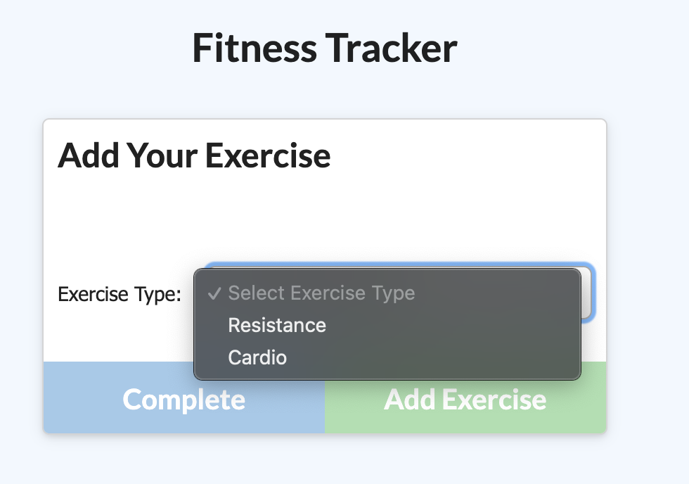
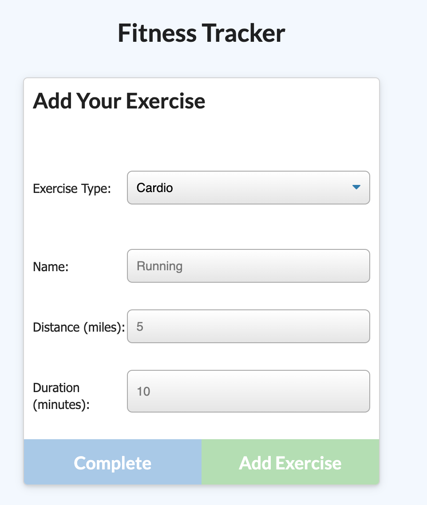
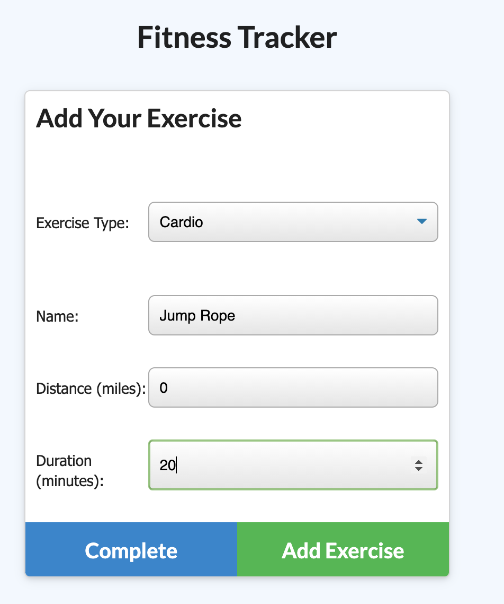
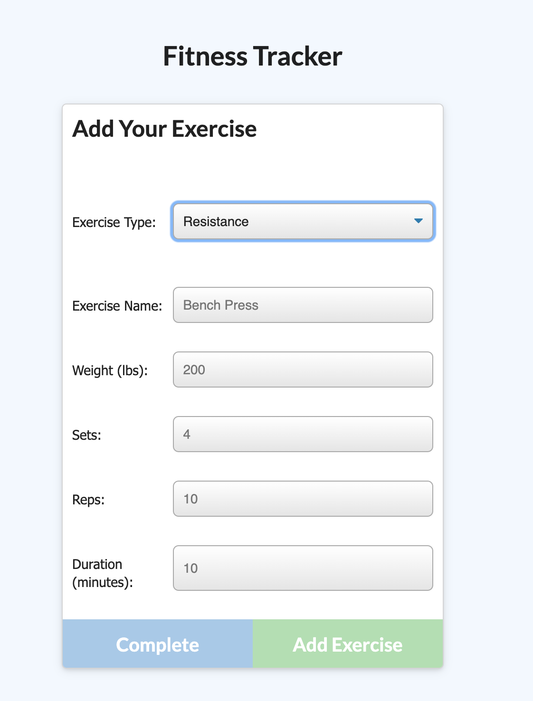
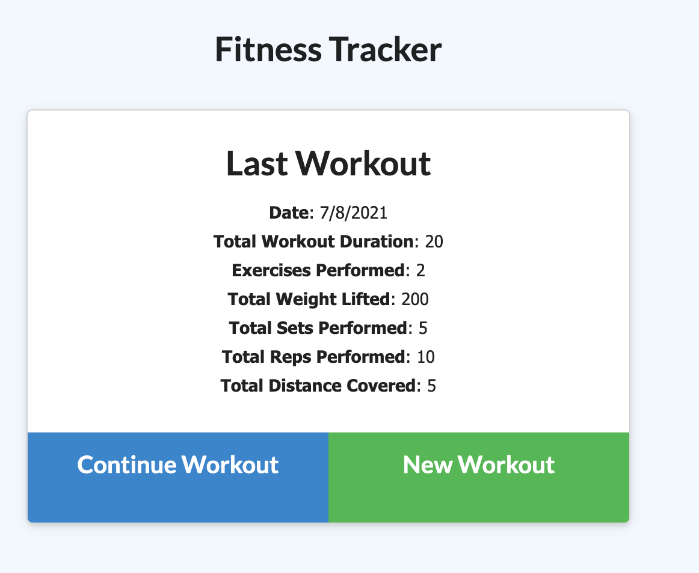

# Workout Tracker

This is a workout tracker that is deployed to Heroku and uses a Mongo Database.

## Table of Contents
* [Installation Guide](#Installation)
* [How to Use](#Usage)
* [License](#License)
* [Contact Info](#Contact)

## Installation
To use this locally, this app requires Node.js to install and use. The package.json is already provided, so navigate to the project folder and run `npm install`. Or skip all that and simply head over to the live site on [Heroku here](https://werqout-tracker.herokuapp.com/).

## How to Use

To use the workout tracker, if it is your first time, you'll hit the green `New Workout` button. From here, you can add exercises to a new workout plan.

There are cardio and resistance training options. You can add as many exercises as you'd like!

When you've input the data for your last exercise, press the blue Complete button. This takes you back to the dashboard, where you can see your stats from the last workout you did. This should show up the next time you login, and if you want to continue off that workout, you can by pressing the Continue Workout button.

You can see your past stats by clicking the Dashboard link at the top to see graphs.

## License
This project is licensed under the MIT license.

©[corgimaman](https://github.com/corgimaman)

## Contact
Questions? Comments? Feel free to reach out to me at helloidaworld@gmail.com or on [GitHub](https://github.com/corgimaman).